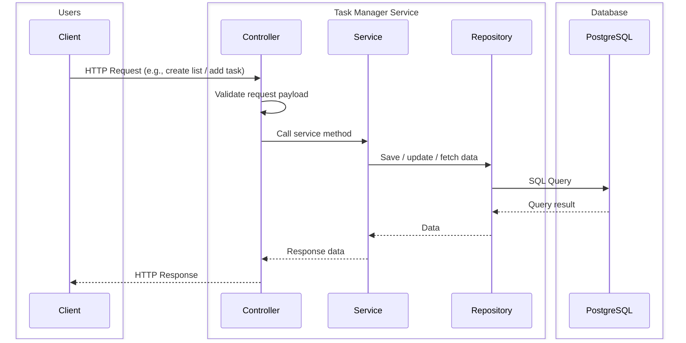
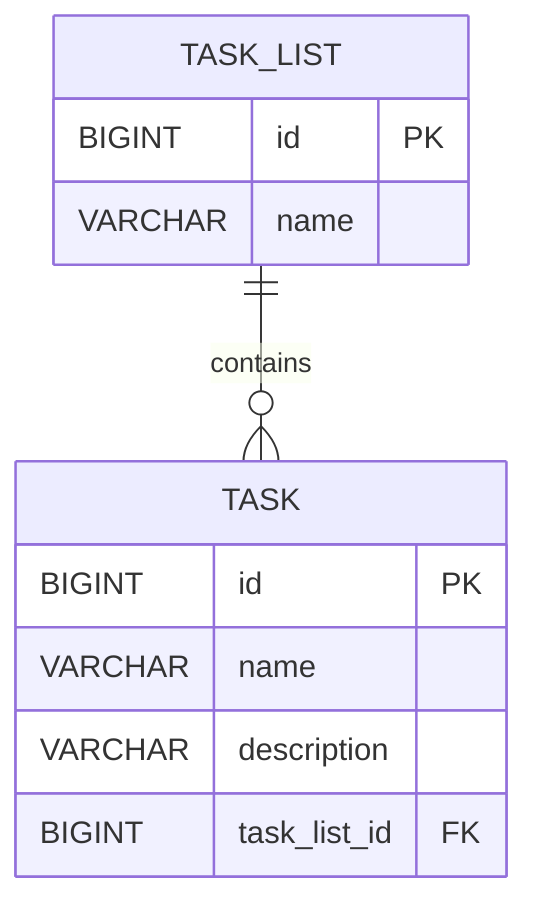

# Task Manager Service

A Spring Boot REST API service to manage task boards. It provides endpoints to create lists, add/update/delete tasks, 
and move tasks across lists. The service layer handles business logic, validation, and interactions with repositories, 
ensuring data consistency and performance optimizations.

The Task Manager service can be run locally using Docker Compose, which sets up both the application and the PostgreSQL database. 
The database uses a named volume to persist data across container restarts, ensuring that all lists and tasks remain intact even if the containers are stopped or recreated. 
Data is only lost if the volume or container is explicitly deleted. This approach allows developers to start the service quickly without installing Java, Maven, or PostgreSQL locally.
---
## Documentation Content
- Tech Stack & Tools
- User Stories
- Architecture Overview
- Service Layer Responsibilities
- Validation Rules
- Performance Notes
- Domain & Data Model
- API Overview
- Request/Response Examples
- How to run application
---
## Tech Stack & Tools

- **Service Layer**
    - Java 21
    - Spring Boot (Web, Validation)
    - Spring Data JPA (Hibernate)
    - PostgreSQL (Relational Database)

- **Test Suit**
    - JUnit 5
    - Mockito
    - Spring Boot Test
    - MockMvc (controller testing)

- **Build & Dependency Management**
    - Maven

- **Containerization**
    - Docker
    - Docker Compose

- **Others**
    - Lombok (To reduce boilerplate code)
    - SLF4J + Logback (logging)
    - EntityGraph (To solve N+1 query problem)
---
## User Stories

- View all lists and their tasks
- Create an empty list with a name
- Add tasks to an existing list (name + description)
- Update a task’s name and description
- Delete a task from a list
- Delete an entire list with all its tasks
- Move a task to a different list
---
## Architecture Overview

The Task Manager service follows a layered architecture:

1. Controller Layer – Handles incoming HTTP requests, performs validation, and maps requests to service methods.
2. Service Layer – Contains business logic, validation, and orchestrates repository calls.
3. Repository Layer – Interacts with the database using Spring Data JPA.
4. Database – PostgreSQL stores lists and tasks in relational tables.



### Service Layer Responsibilities
- Controller: HTTP I/O, delegates to service, runs request DTO validation.
- Service: Business logic, repository coordination, mapping to responses.
- Repositories: Persistence with Spring Data JPA.
- DTOs: Request validation and response shaping.

### Validation Rules

#### TaskListRequest
- `name`: required, max 128 characters

#### TaskRequest
- `name`: required, max 128 characters
- `description`: required, max 128 characters

> Validation is enforced in the **controller** (`request.validate()`) before delegating to the service.

### Performance Notes

- `Task.taskList` and `TaskList.tasks` use **LAZY loading** by default.
- To avoid the **N+1 select problem** when fetching all lists with tasks, the repository method `TaskListRepository#findAllWithTasks()` uses **`@EntityGraph`**:

```java
@EntityGraph(attributePaths = "tasks")
@Query("select tl from TaskList tl")
List<TaskList> findAllWithTasks();
```
---
## Domain & Data Model

### Entities

- **TaskList** — `id`, `name`, `tasks` (one-to-many, cascade all, orphan removal)
- **Task** — `id`, `name`, `description`, `taskList` (many-to-one, lazy fetch)

### Entity-Relation Diagram


---
## API Overview

Base path: `/api/v1/task-manager`

| Method | Path                                           | Description                            |
|-------:|------------------------------------------------|----------------------------------------|
|    GET | `/lists`                                       | Get all lists with nested tasks        |
|   POST | `/lists`                                       | Create a new list                      |
|   POST | `/lists/{listId}/tasks`                        | Add a task to a list                   |
|    PUT | `/tasks/{taskId}`                              | Update a task                          |
| DELETE | `/lists/{listId}/tasks/{taskId}`               | Delete a task from a list              |
| DELETE | `/lists/{listId}`                              | Delete a list (and all its tasks)      |
|    PUT | `/lists/{fromListId}/tasks/{taskId}/move/{to}` | Move a task to another list            |

### Request/Response Examples

**Get all lists with tasks**
```bash
curl -X GET http://localhost:8080/api/v1/task-manager/lists \
  -H 'Accept: application/json'
```

**Create list**
```bash
curl -X POST http://localhost:8080/api/v1/task-manager/lists \
  -H 'Content-Type: application/json' \
  -d '{"name":"Week 39 Task List"}'
```
**Add a task to a list**
```bash
curl -X POST http://localhost:8080/api/v1/task-manager/lists/1/tasks \
  -H 'Content-Type: application/json' \
  -d '{"name":"Finish report", "description":"Complete by Friday"}'
```
**Update a task**
```bash
curl -X PUT http://localhost:8080/api/v1/task-manager/lists/1/tasks \
-H 'Content-Type: application/json' \
-d '{"name":"Report completed", "description":"Completed successfully"}'
```
**Delete a task from a list**
```bash
curl -X DELETE http://localhost:8080/api/v1/task-manager/lists/1/tasks/1
```
**Delete a list (and all its tasks)**
```bash
curl -X DELETE http://localhost:8080/api/v1/task-manager/lists/1
```
**Move a task to another list**
```bash
curl -X PUT http://localhost:8080/api/v1/task-manager/lists/1/tasks/1/move/2
```
---
## How to run application

### Prerequisites
- Docker

#### Steps
1. Clone the repository
2. Run the following command to build and start the service:

```bash
docker compose up --build
```
```bash
# Removes all named volumes declared in your compose file, so your database will reset automatically. 
docker compose down -v
```
---